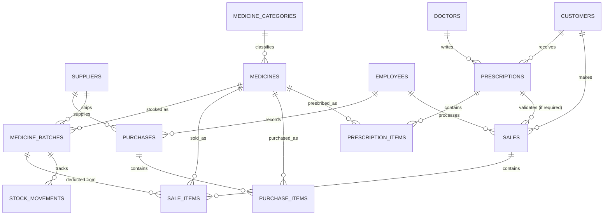

# Entity Relationship Diagram — Apotek

## Ringkasan Relasi

| Tabel | Relasi Utama |
|---|---|
| medicines → medicine_batches | 1-to-many (setiap obat punya banyak batch) |
| medicine_batches → sale_items | 1-to-many (stok dikurangi per batch, prinsip FEFO) |
| suppliers → medicine_batches / purchases | 1-to-many |
| doctors → prescriptions | 1-to-many |
| prescriptions → sales | opsional, wajib untuk obat golongan keras |
| sales → sale_items | 1-to-many |
| medicine_batches → stock_movements | 1-to-many (audit trail masuk/keluar) |
